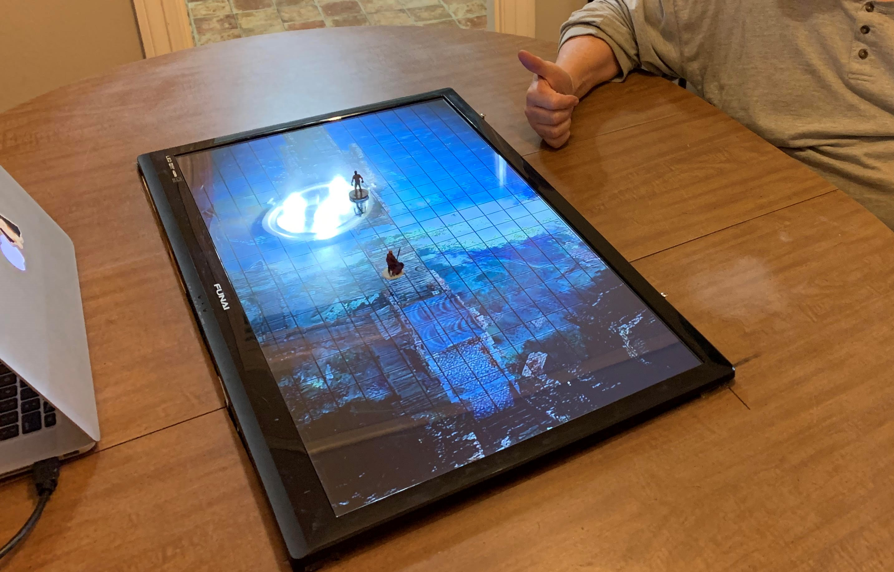

<div id="top"></div>

<!-- PROJECT LOGO -->
<br />
<div align="center">
  <a href="https://jeremyglebe.com/OdinGrid">
    
  </a>

  <h3 align="center">Odin Grid</h3>

  <p align="center">
    A dynamic, customizable game grid for any and all digital tabletops.
    <br />
    <br />
    <a href="https://drowsyprof.itch.io/odin">Support on Itch</a>
    ·
    <a href="https://github.com/jeremyglebe/OdinGrid/issues">Report Bug</a>
    ·
    <a href="https://github.com/jeremyglebe/OdinGrid/issues">Request Feature</a>
  </p>
</div>


<!-- TABLE OF CONTENTS -->
<details>
  <summary>Table of Contents</summary>
  <ol>
    <li>
      <a href="#about-the-project">About The Project</a>
      <ul>
        <li><a href="#built-with">Built With</a></li>
      </ul>
    </li>
    <li>
      <a href="#getting-started">Getting Started</a>
      <ul>
        <li><a href="#prerequisites">Prerequisites</a></li>
        <li><a href="#installation">Installation</a></li>
      </ul>
    </li>
    <li><a href="#usage">Usage</a></li>
    <li><a href="#roadmap">Roadmap</a></li>
    <li><a href="#contributing">Contributing</a></li>
    <li><a href="#license">License</a></li>
    <li><a href="#contact">Contact</a></li>
    <li><a href="#acknowledgments">Acknowledgments</a></li>
  </ol>
</details>


<!-- ABOUT THE PROJECT -->
## About The Project

[](https://drowsyprof.itch.io/odin)
(*OdinGrid displayed over drone footage by Matt Brandt on Youtube. Fullscreen works too!*)

Digital tabletops are cool. If you aren't sure what I'm referring to, digital tabletops are essentially just tables
which serve as a second monitor for a computer. This allows tabletop gamers who own them to display virtual battlemaps,
selectively reveal pictures or documents, and more. (Without needing to print anything!)

[](https://drowsyprof.itch.io/odin)
(*Pictured above is my digital tabletop, hacked together out of an old table with the help of my dad, who is giving the \*thumbs up\**)

Perhaps the coolest feature of digital tabletops are animated battlemaps. (Many of which also come with sound!) Digital
tabletops can come in the form of televisions mounted inside of tables, projectors facing down from the ceiling, and
many more solutions.

Digital tabletops can also be difficult to use. There are a lot of barriers during set up, one of which is
**actually obtaining fun and usable maps**. Maps for DTTs come in several forms: videos, gifs, sometimes projects for
specific online platforms. Personally, I like using animated battlemap YouTube videos. (Of which there are hundreds)
Still, just finding a map may not be enough. If you like gaming using grids (I do!) then you may find yourself rather
disappointed with your selection. Many of these animated maps do not have grids overlayed on them. And those that do
may not have your preferred grid shape (hex > squares) or may be scaled poorly for your screen.

I am providing a solution to but one of these predicaments, but I have found that it is enough for me to maximize
enjoyment of my digital tabletop. **Odin Grid** overlays a customizable game grid over all other applications on your
screen. You can toggle the grid mode between squares, hexes, and none. You can resize the grid to match up with your
screen. Since it displays over whatever is already on your screen, you can just open battlemap in whatever default
application it uses (fullscreen YouTube videos, for instance), open Odin Grid, and make any small adjustments you like.

No need to get a video editor. No need to tape a plastic grid over your physical screen. Just launch Odin Grid and you
are good to play, switching between videos and images without a care. *Odin Grid is the all-father of battlemaps.*

<p align="right">(<a href="#top">back to top</a>)</p>


### Built With

These beautiful frameworks made Odin Grid possible.

* [p5.js](https://p5js.org/)
* [Electron](https://www.electronjs.org/)

<p align="right">(<a href="#top">back to top</a>)</p>


<!-- GETTING STARTED -->
## Getting Started

You have two choices to run Odin Grid. You can clone this open source repository, install the dependencies, then
run or build Odin Grid from the project directory.

You can also purchase some pre-built executables for Windows and Mac on the project's Itch.Io page. Purchasing Odin
Grid on Itch.Io helps support me and my development efforts. I can't tell you how much I would appreciate that.

[Click here to purchase on Itch.Io](https://drowsyprof.itch.io/odin)

Instructions to build the project yourself are found below.

### Running Odin Grid from Source

If you do not already have NodeJS on your system, you will need it. Clone this repository and then open a terminal
in the Odin Grid directory and run the following commands.

```sh
# Downloads all dependencies for the project
npm install
# Run Odin Grid without the need for an executable
npm start
```

### Building Odin Grid Executables

You will need to install the build tool used for Odin Grid, which is **electron-builder**. If you have NodeJS on your
machine (you should) you can install electron-builder with the following command:

```sh
npm i -g electron-builder
```

After you have electron-builder installed, you should be able to run any of the following commands from the Odin Grid
directory to build the application. (Note: You may need to be using a device of the given platform, such as building
for Mac using a Mac device)

```sh
# Builds a standalone app for Windows in the dist/ folder
electron-builder build --windows
# You may also be able to simply use the following command, which should default to targeting your current system
electron-builder build
```

<p align="right">(<a href="#top">back to top</a>)</p>


<!-- ROADMAP -->
## Roadmap

- [x] Overlay square and hex grids
- [x] Display grids over fullscreen applications
- [ ] Improve user interface
- [ ] Allow screen blackout and brush to reveal

See the [open issues](https://github.com/jeremyglebe/OdinGrid/issues) for a full list of proposed features (and known issues).

<p align="right">(<a href="#top">back to top</a>)</p>


<!-- CONTRIBUTING -->
## Contributing

Contributions are what make the open source community such an amazing place to learn, inspire, and create. Any contributions you make are **greatly appreciated**.

If you have a suggestion that would make this better, please fork the repo and create a pull request. You can also simply open an issue with the tag "enhancement".
Don't forget to give the project a star! Thanks again!

1. Fork the Project
2. Create your Feature Branch (`git checkout -b feature/AmazingFeature`)
3. Commit your Changes (`git commit -m 'Add some AmazingFeature'`)
4. Push to the Branch (`git push origin feature/AmazingFeature`)
5. Open a Pull Request

<p align="right">(<a href="#top">back to top</a>)</p>


<!-- LICENSE -->
## License

Distributed under the MIT License. See `LICENSE.txt` for more information.

<p align="right">(<a href="#top">back to top</a>)</p>


<!-- CONTACT -->
## Contact

Jeremy Glebe - [social link]() - jeremyglebe@gmail.com

Project Link: [https://github.com/jeremyglebe/OdinGrid](https://github.com/jeremyglebe/OdinGrid)

<p align="right">(<a href="#top">back to top</a>)</p>


<!-- ACKNOWLEDGMENTS -->
## Acknowledgments

| Credit                            | Source                                                         | Link                                              | Description                                                        |
| --------------------------------- | -------------------------------------------------------------- | ------------------------------------------------- | ------------------------------------------------------------------ |
| GitHub user `mqliutie` and others | `robsontenorio`'s question on the `electron` Github Repository | https://github.com/electron/electron/issues/10078 | How to display an electron window over fullscreen apps? (Overlays) |

<p align="right">(<a href="#top">back to top</a>)</p>
